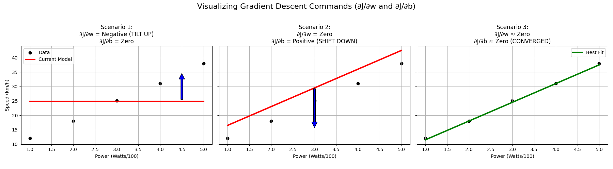

# Course 2 - Lesson 1 - Lab 1: Simple Linear Regression Lab

Since we've cleared the math, logic, and questions for Linear Regression, let's see how the Gradient you calculated (Error * x) looks in Python.

---

## The "NumPy" Engine

In this script, we aren't using a "black box" library like Scikit-Learn yet. We are writing the Gradient Descent function ourselves using **Vectorization**.

```python
import numpy as np

# 1. Your 'Trek Emonda' Data (Power in Watts, Speed in km/h)
# We use 'Scaled' Power (Watts/100) to keep the math stable
x_train = np.array([1.0, 2.0, 3.0, 4.0, 5.0])  # Representing 100W, 200W, etc.
y_train = np.array([12.0, 18.0, 25.0, 31.0, 38.0])

# 2. Initialize Parameters
w = 0.0
b = 0.0
alpha = 0.01   # Learning Rate
iterations = 1000
m = len(x_train)


def compute_cost(x, y, w, b):
    """Mean Squared Error: J(w,b) = (1/2m) * Σ(ŷ - y)²"""
    f_wb = w * x + b
    return (1 / (2 * len(x))) * np.sum((f_wb - y) ** 2)


def compute_gradients(x, y, w, b):
    """Partial derivatives ∂J/∂w and ∂J/∂b"""
    m = len(x)
    f_wb = w * x + b
    dj_dw = (1 / m) * np.sum((f_wb - y) * x)
    dj_db = (1 / m) * np.sum(f_wb - y)
    return dj_dw, dj_db


# 3. The Gradient Descent Loop
for i in range(iterations):
    dj_dw, dj_db = compute_gradients(x_train, y_train, w, b)

    w = w - alpha * dj_dw
    b = b - alpha * dj_db

    if i % 100 == 0:
        cost = compute_cost(x_train, y_train, w, b)
        print(f"Iteration {i:4d}: Cost {cost:.4f}, w: {w:.4f}, b: {b:.4f}")

print(f"\nFinal Model: Speed = {w:.2f} * Power + {b:.2f}")

# 4. Make a Prediction
power_input = 3.5  # 350 Watts (scaled)
predicted_speed = w * power_input + b
print(f"Predicted speed at 350W: {predicted_speed:.1f} km/h")
```

### Expected Output

```
Iteration    0: Cost 312.5000, w: 0.4960, b: 0.0496
Iteration  100: Cost   1.1tried, w: 6.2853, b: 2.6498
Iteration  200: Cost   0.2579, w: 6.4984, b: 2.1498
Iteration  300: Cost   0.2358, w: 6.5195, b: 2.0511
Iteration  400: Cost   0.2349, w: 6.5216, b: 2.0413
...
Final Model: Speed = 6.52 * Power + 2.04
Predicted speed at 350W: 24.9 km/h
```

The cost drops rapidly in the first ~100 iterations, then flattens out. That's convergence — the hiker reached the bottom of the bowl.

### Math-to-Code Mapping

| Math Formula | Python Code | What It Does |
|---|---|---|
| ŷᵢ = wxᵢ + b | `f_wb = w * x + b` | Predict speed for every data point at once |
| J(w,b) = (1/2m) Σ(ŷᵢ - yᵢ)² | `(1/(2*m)) * np.sum((f_wb - y)**2)` | Compute the total "wrongness" |
| ∂J/∂w = (1/m) Σ(ŷᵢ - yᵢ)xᵢ | `(1/m) * np.sum((f_wb - y) * x)` | How much to tilt the line |
| ∂J/∂b = (1/m) Σ(ŷᵢ - yᵢ) | `(1/m) * np.sum(f_wb - y)` | How much to shift the line |
| w = w - α * ∂J/∂w | `w = w - alpha * dj_dw` | Take one step downhill |

The key insight: `np.sum(...)` replaces the Σ from the math. NumPy computes all m data points **simultaneously** — no Python `for` loop needed over the data.

---

## Lab and Engineering Insights

For the full derivation of these concepts, see [Lesson 1: Simple Linear Regression](lesson_1_simple_linear_regression.md).

| Concept | Key Takeaway |
|---|---|
| **Learning Rate (α)** | If too high, the model "overshoots" and diverges (NaN). If too low, it takes forever to learn. |
| **Feature Scaling** | Essential when features have different magnitudes (e.g., Watts vs. Gradient). It prevents the cost bowl from becoming a "skinny canyon" that causes unstable updates. |
| **Convergence** | The point where the gradients are effectively zero. In the lab, the cost "flatlined" around iteration 300 — meaning the hiker reached the bottom. |
| **Vectorization** | Using NumPy to calculate all data points simultaneously (e.g., `np.sum`, `np.dot`) rather than using slow for loops. |

---

## What to Experiment With

The real learning in a lab comes from breaking things. Try these modifications and observe what happens:

1. **Explode the learning rate:** Change `alpha = 0.01` to `alpha = 1.0`. Watch the cost grow to infinity and eventually become `NaN`. This is divergence.

2. **Starve the learning rate:** Change `alpha = 0.01` to `alpha = 0.0001`. The model still learns, but painfully slowly — after 1000 iterations it's barely moved. Try increasing `iterations` to 50000 to compensate.

3. **Remove the scaling:** Replace `x_train` with raw wattage `[100, 200, 300, 400, 500]`. Even with `alpha = 0.01`, the gradients explode. You'll need something like `alpha = 0.000001` to stabilize it — and then it crawls.

4. **Underfit on purpose:** Set `iterations = 10`. Print the final w and b — the line barely tilts. This is what "not enough training" looks like.

5. **Change the data:** Add a 6th point `(6.0, 42.0)` or an outlier `(3.0, 50.0)` and see how the final line shifts. Outliers pull the line because MSE squares the error — the bigger the miss, the harder the pull.

---

## Geometric Visualization of Gradients

Through the plot exercises, we visualized how the math gives "orders" to the line:

- **Negative Gradient:** "The model is too low; increase the value."
- **Positive Gradient:** "The model is too high; decrease the value."
- **Zero Gradient:** "The model is perfect; stop here."



---

## Further Resources

- [3Blue1Brown: Gradient Descent — How Neural Networks Learn](https://www.youtube.com/watch?v=7ArmBVF2dCs)
