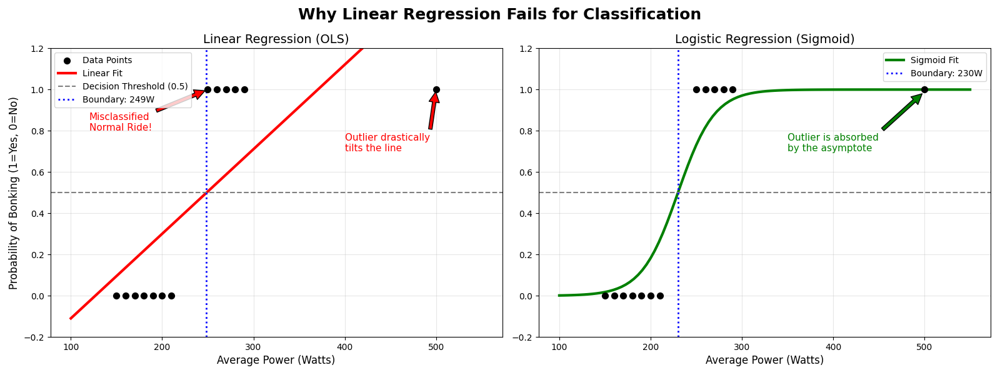
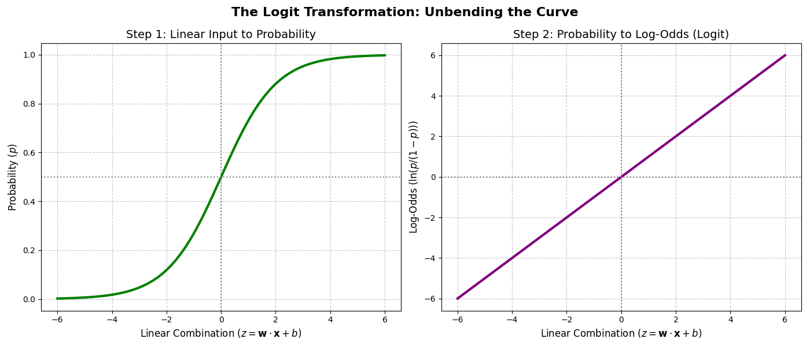
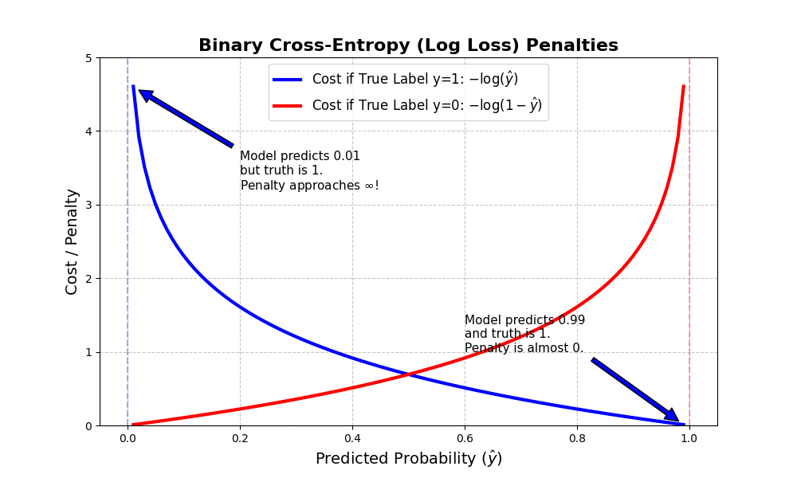

# Course 2 - Lesson 2: Logistic Regression (Binary Classification)

In Lesson 1, we predicted a continuous variable (Speed) based on an input (Power). Now, our target variable y is **discrete**. Let's frame this using your cycling:

- y = 1 (You "bonked" / exhausted your glycogen stores).
- y = 0 (You finished the ride strong).

You might ask: *"Why can't we just use Linear Regression and say that if ƒ(x) ≥ 0.5, we predict y=1?"*

Using ordinary least squares (OLS) for classification fundamentally breaks down for two mathematical reasons:

1. **Unbounded Outputs:** A linear model ƒ(x) = wx + b can output values like -12.4 or 405.2. In a probability framework where we need a likelihood between 0 and 1, these numbers are undefined and meaningless.
2. **Sensitivity to Outliers:** If we add a massive outlier to our dataset (e.g., a ride where you pushed 800W for a short sprint and bonked), it will physically tilt the regression line toward it. This tilt shifts the 0.5 threshold, causing the model to misclassify perfectly normal data points.

> **Linear Regression** fits a line to the data. **Logistic Regression** fits a line to the *boundary between classes*.



- **The Misclassification (Left Chart):** The dotted line marks where the model says "Anything to the right is a Bonk." Because of a massive outlier, the regression line is dragged down, misclassifying 250W and 260W rides as "Finished Strong" even though they are clearly bonks.
- **The Asymptote (Right Chart):** The S-curve handles the outlier gracefully. The top of the curve flattens out (approaches 1.0 but never passes it), so the outlier sits safely in "100% chance of bonking" territory without warping the rest of the curve.
- **The Meaningless Output:** The regression line goes above 1.0 and below 0.0 — a probability of -0.2 or 1.15 makes zero mathematical sense.

---

## The Sigmoid (Logistic) Function

To fix the unbounded output problem, we need a mathematical "compressor" — a function that maps any real number, from -∞ to +∞, into the strict interval (0, 1).

Enter the **Sigmoid Function** (often denoted as g or σ):

```
         1
g(z) = -------
       1 + e⁻ᶻ
```

Here is how we build the Logistic Regression hypothesis:

1. Compute the standard linear combination: **z = wx + b**
2. Pass z through the sigmoid: **ƒ(x) = g(z)**

The full hypothesis equation:

```
            1
ƒ(x) = -----------
        1 + e⁻⁽ʷˣ⁺ᵇ⁾
```

### Analyzing the Limits of g(z)

Let's verify the mathematical boundaries:

| z | e⁻ᶻ | Denominator | g(z) |
|---|---|---|---|
| z → +∞ | e⁻ᶻ → 0 | 1 + 0 = 1 | g(z) → **1** |
| z → -∞ | e⁻ᶻ → ∞ | 1 + ∞ = ∞ | g(z) → **0** |
| z = 0 | e⁰ = 1 | 1 + 1 = 2 | g(0) = **0.5** |

### The Sigmoid Family

In mathematics, a **Sigmoid Function** refers to an entire family of functions that share these properties:

- They are continuous and differentiable everywhere.
- They have a positive first derivative (they strictly increase).
- They have horizontal asymptotes (they flatten out at the top and bottom).

Other famous members you will encounter later include the **Hyperbolic Tangent** (tanh(z)) and the **Arctangent** (arctan(z)).

---

## Why "Logistic"?

The name comes from the mathematical inverse of the Logistic Function, called the **Logit Function** (pronounced *low-jit*).

If p is the probability of an event (like bonking), the **odds** of that event are:

```
           p
odds(p) = ---
          1-p
```

The natural logarithm of those odds is the **Logit**:

```
logit(p) = ln(p / (1-p))
```

Odds alone are mathematically "skewed." By taking the log of odds, we bring back **symmetry** to the data range.

Here is the beautiful trick: if you take the probability output of Logistic Regression and run it backward through the Logit function, you get the straight line back:

```
ln(ŷ / (1-ŷ)) = wx + b
```

This means **Logistic Regression is actually just performing regular Linear Regression on the log-odds of the target.**



See [Appendix A](appendix.md#appendix-a-deriving-the-logit-from-the-sigmoid) for the full derivation.

---

## The Decision Boundary

The model classifies by asking: "Is ŷ ≥ 0.5?" That happens when g(z) = 0.5, which means z = 0 (look at the limits table above). Since z = wx + b, the **decision boundary** is the value of x where:

> wx + b = 0 → x = -b / w

For the model we'll work through later (w = 0.05, b = -10):

> x = -(-10) / 0.05 = 10 / 0.05 = **200 Watts**

Any ride above 200W gets classified as a bonk (y = 1). Any ride below gets classified as "finished strong" (y = 0). The sigmoid doesn't *move* the boundary — it smoothly transitions the probability from 0 to 1 *around* it.

---

## The Calculus "Cheat Code": Derivative of the Sigmoid

Remember Gradient Descent? We need the derivative of the sigmoid for backpropagation. Because the derivative of eˣ is just eˣ, the derivative of the Sigmoid collapses into a beautifully simple equation:

> g'(z) = g(z) * (1 - g(z))

### Full Derivation

**Step 1:** Rewrite for easier differentiation:

> g(z) = (1 + e⁻ᶻ)⁻¹

**Step 2:** Apply the Power Rule and Chain Rule. Bring down the -1, subtract one from the exponent:

> g'(z) = -1 * (1 + e⁻ᶻ)⁻² * d/dz(1 + e⁻ᶻ)

**Step 3:** Differentiate the inside. The derivative of 1 is 0. The derivative of e⁻ᶻ requires the chain rule (derivative of -z is -1):

> d/dz(1 + e⁻ᶻ) = -e⁻ᶻ

**Step 4:** Multiply it all together:

> g'(z) = -1 * (1 + e⁻ᶻ)⁻² * (-e⁻ᶻ)

The two negatives cancel:

> g'(z) = e⁻ᶻ / (1 + e⁻ᶻ)²

**Step 5:** The Algebraic Trick — express this in terms of g(z).

Split the squared fraction into two:

> g'(z) = 1/(1 + e⁻ᶻ) * e⁻ᶻ/(1 + e⁻ᶻ)

The first fraction is exactly g(z). For the second, add and subtract 1 in the numerator:

> e⁻ᶻ/(1 + e⁻ᶻ) = (1 + e⁻ᶻ - 1)/(1 + e⁻ᶻ) = 1 - 1/(1 + e⁻ᶻ) = 1 - g(z)

Therefore:

> **g'(z) = g(z) * (1 - g(z))**

If we had used base 10 or base 2 instead of e, the derivative would carry ugly scaling constants like ln(10) that the computer would have to multiply millions of times during training. The function wasn't "made up" to squish numbers — it is the mathematically pure solution to constrained growth, derived from the natural log-odds, and uniquely optimized for calculus.

---

## The Probabilistic Interpretation

The output of the model is formally interpreted as the **estimated probability that y=1 given input x**, parameterized by w and b.

### The Probability of a Positive Outcome (y=1)

> P(y=1 | x; w,b) = ŷ = g(wx + b)

### The Probability of a Negative Outcome (y=0)

> P(y=0 | x; w,b) = 1 - ŷ

Because probabilities must sum to 1.

### Notation Breakdown

| Symbol | Meaning |
|---|---|
| **P** | A probability mass function (PMF). Outputs a value between 0 and 1. |
| **\|** | Conditional probability. Separates what we're finding (left) from what we know (right). |
| **y=1** | The event we're calculating the probability for (positive class). |
| **x** | The observed features (bold implies it could be a vector of multiple features). |
| **;** | Separates random variables (y, x) from fixed parameters (w, b). |
| **w, b** | The model's learned parameters — not data, but internal settings. |

### The Unified Bernoulli Formula

We want **one equation** that works for both y=1 and y=0, avoiding an if/else branch. Because y ∈ {0, 1}, we use a clever exponent trick from the **Bernoulli Distribution**:

> P(y | x; w,b) = ŷʸ * (1 - ŷ)¹⁻ʸ

**Test 1: y = 1**

> P = ŷ¹ * (1 - ŷ)⁰ = ŷ * 1 = **ŷ** ✓

**Test 2: y = 0**

> P = ŷ⁰ * (1 - ŷ)¹ = 1 * (1 - ŷ) = **1 - ŷ** ✓

This unified formula is the foundational building block for the Logistic Regression Cost Function.

---

## The Cost Function

We **cannot** use Mean Squared Error (MSE) for Logistic Regression. If you plug the non-linear Sigmoid into MSE, the resulting 3D Cost Surface is **non-convex** — it looks like a crumpled piece of paper with dozens of "fake bottoms" (local minima). Gradient Descent would get stuck.

To build a **convex** Cost Function for probabilities, we derive it from statistics using **Maximum Likelihood Estimation (MLE)**.

### The Likelihood Function

Instead of asking "How far off are my predictions?" (like MSE), MLE asks:

> *"Given the data I observed, what are the parameters w and b that make this exact dataset the most likely to have occurred?"*

Assuming all m rides are independent, the probability of observing the entire dataset is the product of individual probabilities — the **Likelihood Function (L)**:

```
      ᵐ
L = Π  P(yᵢ | xᵢ; w,b)
     ⁱ⁼¹
```

Substituting the unified Bernoulli equation:

```
      ᵐ
L = Π  ŷᵢʸⁱ * (1 - ŷᵢ)¹⁻ʸⁱ
     ⁱ⁼¹
```

We want to **maximize** this Likelihood. But multiplying hundreds of probabilities (numbers between 0 and 1) produces microscopically small numbers that cause **arithmetic underflow**.

### The Log-Likelihood

To fix underflow and simplify the calculus, we take the natural logarithm of the Likelihood. Because logarithms turn multiplication into addition and bring down exponents:

```
          ᵐ
ln(L) = Σ  [yᵢ * ln(ŷᵢ) + (1-yᵢ) * ln(1-ŷᵢ)]
        ⁱ⁼¹
```

This is the **Log-Likelihood**. We still want to maximize it.

### Binary Cross-Entropy (Log Loss)

Gradient Descent **minimizes** cost — it doesn't maximize likelihood. To flip the problem, we multiply by -1 and average over m:

```
           1   ᵐ
J(w,b) = ---- * Σ  [-yᵢ * ln(ŷᵢ) - (1-yᵢ) * ln(1-ŷᵢ)]
           m  ⁱ⁼¹
```

This is the official Cost Function for Logistic Regression: **Binary Cross-Entropy** (or Log Loss).

### Why Multiply by -1?

**Statistics** uses Maximum Likelihood — climb to the top of the highest peak. **Gradient Descent** is hardcoded to minimize — walk to the bottom of a bowl. Maximizing ƒ(x) is mathematically identical to minimizing -ƒ(x). We invert the "hill" into a "bowl."

### Why Divide by m?

Without averaging, the total cost scales with dataset size — a dataset copied 10,000 times would have 10,000x the cost despite identical predictions. This would make gradients explode and make the learning rate un-transferable between datasets of different sizes. Dividing by m turns J into the **"Expected Error per Data Point,"** keeping gradients stable whether you train on 100 rows or a billion.

### Visualizing the Penalty



The core mechanic of Cross-Entropy:

- If the true label is **1** and the model predicts ŷ = 0.99, the cost is practically **0**. Confident and correct.
- If the true label is **1** and the model predicts ŷ = 0.01 (extremely confident you *won't* bonk), the curve shoots up toward **infinity**. Log Loss heavily penalizes models that are confident but wrong.

---

## Model Example: A Complete Forward Pass

Assume the model has learned:

- Weight (w): 0.05
- Bias (b): -10

We pass a single ride through:

- Input Feature (x): 220 Watts
- True Label (y): 1 (You bonked)

### Step 1: The Linear Combination (z)

> z = wx + b = 0.05 * 220 + (-10) = 11 - 10 = **1**

The raw log-odds score is 1. On its own, this number is meaningless — we must compress it.

### Step 2: The Sigmoid Function (ŷ)

> ŷ = 1 / (1 + e⁻¹) = 1 / (1 + 0.3679) = 1 / 1.3679 = **0.731**

The model predicts a **73.1% probability** that this ride results in a bonk.

### Step 3: The Cost (J) — Model Is Correct

Since the true label is y = 1:

> J = -ln(ŷ) = -ln(0.731) = **0.313**

A relatively small penalty — the model was fairly confident (73.1%) and correct.

### Step 4: The Counter-Factual — What If It Was Wrong?

Same ride, same prediction (73.1%), but the true label is y = 0 (you finished strong):

> J = -ln(1 - ŷ) = -ln(1 - 0.731) = -ln(0.269) = **1.313**

The penalty **quadruples**. The model was confidently predicting a bonk, but you finished strong. Cross-Entropy violently punishes misplaced confidence.

### Step 5: Adjusting w and b

Despite the prediction changing from a straight line to a Sigmoid, the gradient formulas are **identical to Linear Regression**:

```
∂J     1   ᵐ
--- = --- * Σ  (ŷᵢ - yᵢ) * xᵢ
∂w     m  ⁱ⁼¹

∂J     1   ᵐ
--- = --- * Σ  (ŷᵢ - yᵢ)
∂b     m  ⁱ⁼¹
```

This isn't a coincidence. When you take the derivative of the cross-entropy cost through the sigmoid, the sigmoid's derivative — g(z)(1 - g(z)), which we derived earlier — cancels perfectly with terms from the cross-entropy derivative. The result is the same clean (ŷ - y) error term. This elegant cancellation is one of the reasons cross-entropy was chosen as the cost function for logistic regression.

**Calculate the Error:**

> ŷ - y = 0.731 - 1 = **-0.269**

The model under-predicted the likelihood of the bonk by 26.9%.

**Gradient for w:**

> ∂J/∂w = -0.269 * 220 = **-59.18**

**Gradient for b:**

> ∂J/∂b = **-0.269**

**Update Step** (with α = 0.01):

> w_new = 0.05 - 0.01 * (-59.18) = 0.05 + 0.5918 = **0.6418**

> b_new = -10 - 0.01 * (-0.269) = -10 + 0.00269 = **-9.997**

Notice that w jumped from 0.05 to 0.6418 — a 12x increase in a single step. This is because x = 220 is unscaled, amplifying the gradient massively. In practice, we'd scale the input (just like in Lesson 1) to keep updates stable.

---

## Practice Problems

### Problem 1: Compute the Sigmoid

Calculate g(z) for the following values of z:

| z | g(z) |
|---|---|
| z = 0 | ? |
| z = 2 | ? |
| z = -3 | ? |

**Solution:**

| z | Calculation | g(z) |
|---|---|---|
| z = 0 | 1 / (1 + e⁰) = 1 / 2 | **0.500** |
| z = 2 | 1 / (1 + e⁻²) = 1 / (1 + 0.1353) = 1 / 1.1353 | **0.881** |
| z = -3 | 1 / (1 + e³) = 1 / (1 + 20.086) = 1 / 21.086 | **0.047** |

Notice: z = 2 gives 88.1% (strong positive → high probability), z = -3 gives 4.7% (strong negative → low probability), and z = 0 is always exactly 50/50.

---

### Problem 2: Cross-Entropy Cost

Your model predicts ŷ = 0.85. Calculate the cost for both possible true labels.

**Solution:**

**If y = 1** (model is correct):

> J = -ln(0.85) = **0.163**

Small penalty — confident and right.

**If y = 0** (model is wrong):

> J = -ln(1 - 0.85) = -ln(0.15) = **1.897**

Huge penalty — the model was 85% sure of a bonk, but the rider finished strong. Cross-entropy punishes this misplaced confidence.

---

### Problem 3: Full Forward and Backward Pass

A model has w = 0.03, b = -5, and α = 0.1. A single ride comes in: x = 250W, y = 1 (bonk).

**1. Linear combination:**

> z = 0.03 * 250 + (-5) = 7.5 - 5 = **2.5**

**2. Sigmoid:**

> ŷ = 1 / (1 + e⁻²·⁵) = 1 / (1 + 0.0821) = 1 / 1.0821 = **0.924**

**3. Cost:**

> J = -ln(0.924) = **0.079**

Very small — the model is 92.4% confident and correct.

**4. Error:**

> ŷ - y = 0.924 - 1 = **-0.076**

**5. Gradients:**

> ∂J/∂w = -0.076 * 250 = **-19.0**
>
> ∂J/∂b = **-0.076**

**6. Update:**

> w_new = 0.03 - 0.1 * (-19.0) = 0.03 + 1.9 = **1.93**
>
> b_new = -5 - 0.1 * (-0.076) = -5 + 0.0076 = **-4.992**

Again, w explodes (0.03 → 1.93) because x = 250 is unscaled. With scaled features (x = 0.25), the gradient would be -0.076 * 0.25 = -0.019, and the update would be a modest 0.03 + 0.0019 = 0.0319.

---

## Linear Regression vs. Logistic Regression

| | Linear Regression | Logistic Regression |
|---|---|---|
| **Task** | Predict a continuous value (speed, price) | Predict a class (bonk / no bonk) |
| **Hypothesis** | ŷ = wx + b | ŷ = g(wx + b) = 1 / (1 + e⁻⁽ʷˣ⁺ᵇ⁾) |
| **Output range** | (-∞, +∞) | (0, 1) — a probability |
| **Cost Function** | MSE: (1/2m) Σ(ŷ - y)² | Cross-Entropy: -(1/m) Σ[y ln(ŷ) + (1-y) ln(1-ŷ)] |
| **Cost shape** | Always convex (bowl) | Convex (because we derived it from MLE, not MSE) |
| **Gradient ∂J/∂w** | (1/m) Σ(ŷ - y) * x | (1/m) Σ(ŷ - y) * x — **identical form** |
| **Decision output** | The number itself (22 km/h) | Compare ŷ to threshold (usually 0.5) |
| **Evaluation** | MSE, R² | Accuracy, Precision, Recall, F1 (covered in a future lesson) |

The identical gradient formula is the punchline: despite completely different cost functions and hypotheses, the update rule has the same form. This is not a coincidence — it falls out of the mathematical relationship between the sigmoid and cross-entropy.

---

## Key Takeaways

- **Logistic Regression** models the probability of a binary outcome using the **Sigmoid Function** to squash any real number into (0, 1).
- The **Decision Boundary** is where wx + b = 0. Everything on one side is class 1; everything on the other is class 0.
- We can't use MSE because it creates a non-convex cost surface. Instead, we derive **Binary Cross-Entropy** from **Maximum Likelihood Estimation**, guaranteeing convexity.
- Cross-entropy **heavily punishes confident wrong predictions** — being 99% sure and wrong costs far more than being 51% sure and wrong.
- The gradient formulas end up **identical to Linear Regression** thanks to the elegant cancellation between the sigmoid derivative and the cross-entropy derivative.
- The **Unified Bernoulli Formula** lets us write one equation for both y = 0 and y = 1, which is the foundation of the entire cost derivation.

For the historical origin of the Logistic Function (Verhulst, 1838) and the derivation of why e appears in the formula, see [Appendix B](appendix.md#appendix-b-the-origin-of-the-logistic-function).

---

## Further Reading

### Free Textbooks (Rigorous Statistical Theory)

- **The Elements of Statistical Learning** (Hastie, Tibshirani & Friedman) — Read Section 4.4: Logistic Regression. Gold-standard statistical derivation, including fitting via Newton-Raphson (an alternative to Gradient Descent). [Link to Book](https://hastie.su.domains/ElemStatLearn/)

- **Deep Learning** (Goodfellow, Bengio & Courville) — Read Section 5.5: Maximum Likelihood Estimation. Cements why we use cross-entropy as a cost function, linking it to KL divergence. [Link to Book](https://www.deeplearningbook.org/)

### University Course Materials

- **Stanford CS229** (Machine Learning) — Read Lecture Notes 1, Part II (Classification and Logistic Regression) and Part III (Generalized Linear Models). [Link to CS229 Materials](https://cs229.stanford.edu/)

### Video Lectures

- **Stanford CS229 Lecture 3** — Andrew Ng's whiteboard derivation of the Logistic Regression cost function and gradient step. [Watch on YouTube](https://youtu.be/het9HFqo1TQ?si=IFAExdj-BoVkDY5p)
