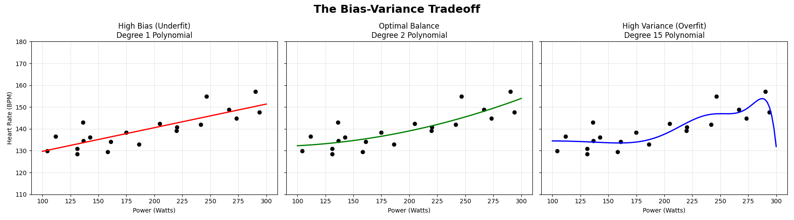
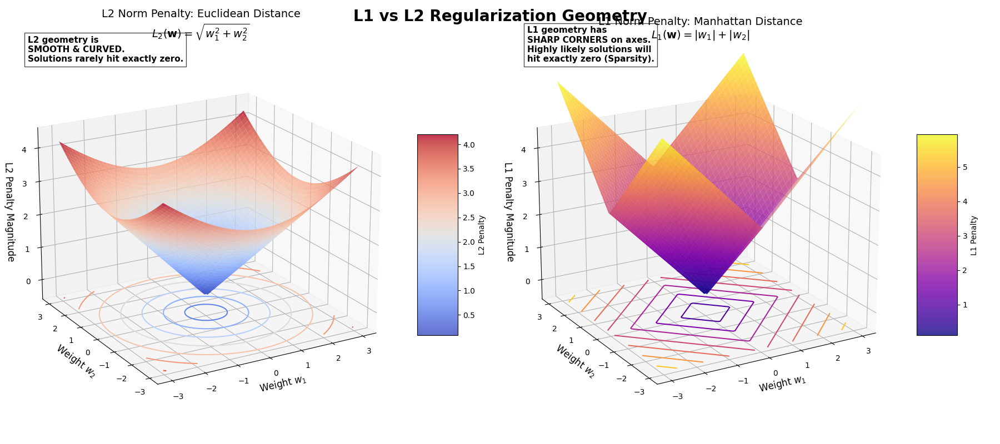

# Course 2 - Lesson 3: Overfitting, the Bias-Variance Tradeoff, and Regularization

---

## The Core Problem: The Danger of Perfect Memory

In Lessons 1 and 2, our entire objective was to minimize the Cost Function J(w, b). We mathematically defined "goodness" as the lowest possible error on our training data.

But this introduces a fatal flaw: **if you give a model enough parameters, it will simply memorize the data, including the random noise.**

In machine learning, we don't actually care how well your model performs on the data it has already seen (the **Training Set**). We only care how well it **generalizes** to data it has never seen (the **Test Set**). When a model performs perfectly on training data but catastrophically fails on new data, it has **overfit**.

### Train/Test Split

To detect overfitting, we split our data *before* training:

- **Training Set (~80%):** The model learns from this data (Gradient Descent runs on it).
- **Test Set (~20%):** The model never sees this during training. We evaluate on it *after* training to measure generalization.

If training cost is low but test cost is high, the model has overfit. If both are high, the model has underfit. If both are low, you've found the sweet spot.

When tuning hyperparameters like λ, we pick the value that minimizes **test cost**, not training cost. (But be careful — if you tune λ repeatedly against the same test set, you risk overfitting to the test set too. The proper solution is **k-fold cross-validation**, which we'll cover in a later lesson.)

---

## The Bias-Variance Tradeoff

1. **High Bias (Underfitting):** The model is too simple to capture the underlying pattern. It makes strong, incorrect assumptions. (e.g., Trying to fit a straight line to a wildly curving dataset.)

2. **High Variance (Overfitting):** The model is too complex. It is hyper-sensitive to the specific training data it was given. If you change even one data point, the entire model violently shifts to accommodate it.

3. **The Sweet Spot:** The goal is to find a model with enough capacity to capture the true signal, but not so much capacity that it captures the noise.



When you look at the generated plot, notice the **Model 3 (High Variance)**. It achieves a training error of almost exactly zero — it touches nearly every single black dot. But it does this by creating massive, violent oscillations. If you fed this model a new ride at 250W, it might predict a Heart Rate of 400 BPM because of how severely the curve warped to memorize the noise.

---

## The Mathematical Solution: Regularization

How do we stop an algorithm from building that violently oscillating Model 3? We change the rules of the game by **changing the Cost Function**.

We introduce **Regularization** (specifically **L2 Regularization**, or "Ridge"). We add a mathematical penalty for complexity directly into the objective.

### Regularized Cost Function (Linear Regression + L2)

```
                ᵐ                        ⁿ
J(w,b) = 1/2m * Σ  (ŷᵢ - yᵢ)²  + λ/2m * Σ  wⱼ²
                ⁱ⁼¹                      ʲ⁼¹
         \__________________/    \______________/
          The "Fit" Term         The "Penalty" Term
```

Compare to the standard Cost Function without L2:

```
                ᵐ
J(w,b) = 1/2m * Σ  (ŷᵢ - yᵢ)²
                ⁱ⁼¹
```

Let's break down this new, two-part equation:

1. **The "Fit" Term (Left):** Your standard Mean Squared Error. It still wants the line to pass as closely to the data points as possible.

2. **The "Penalty" Term (Right):** The L2 norm of the weights. We take every single weight (w₁, w₂, ..., wₙ), square it, sum them up, and multiply by a scaling factor.

### Numerical Example: The Penalty in Action

Suppose an overfit model learned **w** = [10, 8, 12] with λ = 1 and m = 30:

> Penalty = (λ/2m) * (10² + 8² + 12²) = (1/60) * (100 + 64 + 144) = (1/60) * 308 = **5.13**

After regularization shrinks the weights to **w** = [2, 1.5, 2.5]:

> Penalty = (1/60) * (4 + 2.25 + 6.25) = (1/60) * 12.5 = **0.21**

The penalty dropped from 5.13 to 0.21 — a **24x reduction**. The model trades a small increase in MSE for a massive reduction in weight magnitude. The violent oscillations smooth out because the optimizer can no longer afford the enormous weights they require.

---

## The Lambda Parameter (λ)

The symbol **λ** (Lambda) is a **hyperparameter** you control. It acts as the dial for the Bias-Variance tradeoff.

- **If λ = 0:** The penalty disappears. You get standard OLS, and the model is free to overfit.
- **If λ is massive (e.g., 10,000):** The algorithm becomes absolutely terrified of having large weights. It will shrink almost all weights down to near zero. The model becomes a flat line (High Bias / Underfitting).
- **If λ is tuned perfectly:** The algorithm is allowed to use its features, but it is penalized for relying too heavily on any single feature or generating the massive weights required to create those violent polynomial oscillations. The weights are mathematically "shrunk."

### What Is a Hyperparameter?

A **parameter** (like w and b) is learned *by* the model during training — the algorithm figures these out by walking down the cost bowl.

A **hyperparameter** (like λ, the learning rate α, or the number of iterations) is set *by you* before training begins — the algorithm never touches these. You choose them, run training, evaluate, and adjust.

The rule of thumb: if Gradient Descent updates it, it's a **parameter**. If you hardcode it before calling `train()`, it's a **hyperparameter**.

### Connection to the Normal Equation

In Lesson 1, we saw the closed-form solution for Linear Regression:

> **w** = (**X**ᵀ**X**)⁻¹ **X**ᵀ**y**

With L2 regularization, this becomes:

> **w** = (**X**ᵀ**X** + λ**I**)⁻¹ **X**ᵀ**y**

The λ**I** term here is the *same* L2 penalty, just applied algebraically instead of iteratively through Gradient Descent. Adding λ to the diagonal also has a practical benefit: it makes (**X**ᵀ**X** + λ**I**) invertible even when **X**ᵀ**X** alone is singular (remember the "near-zero determinant" problem from Course 1, Lesson 3).

---

## Why Is It Called "L2"?

When we want to penalize the model for having large weights, we need a mathematical way to quantify exactly how "large" the entire weight vector **w** is. The name L2 comes from a branch of linear algebra called **Functional Analysis** — specifically, how we measure the "size" or "length" of a vector using a **Norm**.

### The General Lp Norm

The generalized formula to measure the length of a vector **x** is the **Lp norm**:

```
              ⁿ          1/p
||x||p = ( Σ  |xⱼ|ᵖ )
            ʲ⁼¹
```

By changing the value of p, you change how distance and size are calculated.

### The L2 Norm (Euclidean Distance)

Set p = 2:

```
              ⁿ          1/2
||w||₂ = ( Σ  wⱼ² )        = √(w₁² + w₂² + ... + wₙ²)
            ʲ⁼¹
```

This is the **Pythagorean theorem** — the standard Euclidean distance, the literal physical length of the vector from the origin.

### Why No Square Root in the Cost Function?

Square roots are annoying to differentiate. Since we ultimately need the derivative for Gradient Descent, ML engineers use the **Squared L2 Norm**:

```
                 ⁿ
||w||₂² =  Σ  wⱼ²  = w₁² + w₂² + ... + wₙ²
            ʲ⁼¹
```

Squaring destroys the square root, leaving a simple sum of squared weights that is trivial to differentiate. So it is called **L2 Regularization** because the penalty is derived from the Squared L2 Norm of the weight vector. In classical statistics, this is also known as **Ridge Regression**.

---

## The Natural Follow-Up: What Is L1?

Set p = 1 in the general norm formula:

```
            ⁿ
||w||₁ = Σ  |wⱼ|  = |w₁| + |w₂| + ... + |wₙ|
          ʲ⁼¹
```

This is the sum of the **absolute values** of the weights (often called "Manhattan distance" — you can only move at right angles, like city blocks).

Adding the L1 norm to your Cost Function is called **L1 Regularization** (or **Lasso Regression**).

### The Crucial Difference in Behavior

**L2 (Ridge):** Squares the weights. It hates really large weights, but it doesn't mind lots of tiny weights. It shrinks everything toward zero, but rarely *exactly* to zero.

**L1 (Lasso):** Takes the absolute value. Because of the sharp corners in its geometric shape (a diamond in 2D space), it acts as a **feature selector**. It will aggressively drive the weights of useless features to exactly 0.0, wiping them out of the equation completely.



**Look at the Contours (Bottom Projection):**

- **L2 (Left Plot):** The contours are perfect concentric **circles**. They are totally smooth. If our Cost Bowl intersects this circle, the contact point is unlikely to be exactly on an axis (w₁=0 or w₂=0).

- **L1 (Right Plot):** The contours are sharp **diamonds** / rotated squares. The "corners" of the diamond sit precisely on the axes. The math of optimization proves that when a Cost Bowl is intersected by a diamond, the most likely solution will be on one of those sharp corners.

### Regularization Methods Summary

| Method | Penalty | Effect on Weights | Best For |
|---|---|---|---|
| **L2 (Ridge)** | (λ/2m) Σ wⱼ² | **Shrinkage** — all weights shrink toward zero but stay non-zero | Peak prediction accuracy, correlated features |
| **L1 (Lasso)** | (λ/2m) Σ \|wⱼ\| | **Sparsity** — useless weights driven to exactly 0.0 | Feature selection, interpretability |
| **Elastic Net** | λ₁ Σ \|wⱼ\| + λ₂ Σ wⱼ² | **Both** — sparse and stable | Best of both worlds |

### Choosing Between L1 and L2

**Use L2 (Ridge) by default if:**

- **Goal:** Peak Predictive Performance. L2 generally yields better prediction accuracy because it keeps all features in the game but "mutes" the noise.
- **Data:** Many Small Effects. If you believe most features (Power, Cadence, Heart Rate, Temperature, Sleep) each contribute a little bit, L2 is the right choice.
- **Data:** Multi-collinearity. If features are highly correlated (e.g., Power and Torque), L2 is mathematically more stable than L1.

**Use L1 (Lasso) if:**

- **Goal:** Model Interpretability (Sparsity). If you have 1,000 features but want a model that says "only these 5 matter," use L1. It will zero out the other 995.
- **Goal:** Feature Selection. If you suspect many features are total "garbage" (noise with zero relationship to the target), L1 performs automatic feature selection.
- **Constraints:** Computational Efficiency. A sparse model (with many zeros) is much faster to run and requires less memory once deployed.

### The "Hybrid" Option: Elastic Net

Because this is a tradeoff, modern graduate-level ML often uses **Elastic Net**. This is a cost function that includes **both** penalties:

```
                 ᵐ                       ⁿ                 ⁿ
J(w,b) = 1/2m * Σ  (ŷᵢ - yᵢ)² + λ₁/2m * Σ |wⱼ| + λ₂/2m * Σ  wⱼ²
                ⁱ⁼¹                      ʲ⁼¹               ʲ⁼¹
                                  \____L1____/      \____L2____/
```

This lets you get the feature-selection benefits of L1 while maintaining the mathematical stability and predictive power of L2.

---

## The Calculus: How L2 Changes Gradient Descent

When we add (λ/2m) Σwⱼ² to the cost function, the derivative (gradient) with respect to wⱼ changes. The new gradient becomes:

```
              ᵐ
∂J/∂wⱼ = 1/m * Σ  (ŷᵢ - yᵢ) * xᵢ + λ/m * wⱼ
               ⁱ⁼¹
```

The bias gradient is unchanged (we don't regularize the bias):

```
             ᵐ
∂J/∂b = 1/m * Σ  (ŷᵢ - yᵢ)
              ⁱ⁼¹
```

When you plug this into the update step:

```
              ∂J
wⱼ = wⱼ - α * ---
              ∂wⱼ
```

If you rearrange the algebra:

```
                                     ᵐ
wⱼ = wⱼ * (1 - α * λ/m) - α * 1/m * Σ  (ŷᵢ - yᵢ) * xᵢ
                                     ⁱ⁼¹
     \__________________/   \____________________________/
         Weight Decay           Standard Gradient Step
```

This is the "Aha!" moment. The term **(1 - αλ/m)** is always slightly less than 1. This means in every single step of Gradient Descent, the weight is **first multiplied by a fraction to make it smaller** (Weight Decay), and **then** it moves in the direction of the gradient.

### Why L2 Prevents Overfitting

Overfitting requires **large weights** — the violent oscillations of a 10th-degree polynomial are only possible when some wⱼ values are enormous (hundreds or thousands). The L2 penalty makes large weights *expensive*: a weight of 10 costs 100 penalty units, but a weight of 1 costs only 1.

The optimizer faces a tradeoff: "I could make this weight huge to perfectly fit that one noisy data point, but the penalty would be enormous." So it settles for smaller weights that capture the *general trend* without memorizing individual noise. The polynomial curve smooths out — exactly what we want.

---

## Study Questions

**Q1: Why is the Cost Function regularization called L2?**

Because the penalty term is derived from the **Squared L2 Norm** of the weight vector. The L2 Norm is the Euclidean distance (Pythagorean theorem applied to all weights). We square it to eliminate the square root, making the derivative clean for Gradient Descent. The "2" in L2 refers to the exponent p = 2 in the general Lp norm formula.

**Q2: What is a hyperparameter? How do I tell what is a hyperparameter and what isn't?**

A **parameter** (w, b) is learned *by the model* during training — Gradient Descent updates it. A **hyperparameter** (λ, α, number of iterations, polynomial degree) is set *by you* before training — the algorithm never touches it. The test: if it appears on the left side of an update rule (`w = w - ...`), it's a parameter. If you hardcode it before calling `train()`, it's a hyperparameter.

**Q3: Why does L2 prevent overfitting?**

Overfitting requires large weights to create the extreme oscillations needed to pass through every noisy data point. L2 adds a *cost proportional to the square of each weight*, so large weights become disproportionately expensive. A weight of 10 costs 100 in penalty; a weight of 100 costs 10,000. The optimizer learns to settle for smaller, smoother weights that capture the general trend rather than memorizing noise. The term (1 - αλ/m) in the update rule physically shrinks every weight on every step — this is **Weight Decay**.

---

## Key Takeaways

- **Overfitting** happens when a model memorizes training noise instead of learning the true pattern. It performs well on training data but fails on new data.
- We detect overfitting by comparing **training cost** vs. **test cost** using a train/test split.
- **Regularization** adds a penalty for large weights to the cost function, forcing the optimizer to prefer simpler, smoother models.
- **L2 (Ridge)** shrinks all weights toward zero (shrinkage). **L1 (Lasso)** drives useless weights to exactly zero (sparsity/feature selection). **Elastic Net** combines both.
- **λ** controls the tradeoff: λ = 0 is no regularization (overfit risk), λ = ∞ is maximum penalty (underfit risk).
- The L2 penalty changes the gradient update to include **Weight Decay**: every weight is multiplied by (1 - αλ/m) < 1 on every step.
- The regularized Normal Equation (**X**ᵀ**X** + λ**I**)⁻¹**X**ᵀ**y** is the same penalty applied algebraically — and it also fixes the singular matrix problem from Course 1.

---

## Further Reading

- **The Elements of Statistical Learning** (Hastie, Tibshirani & Friedman) — Read Section 2.9 (Model Selection and Bias-Variance Tradeoff) and Section 3.4 (Shrinkage Methods). [Link to Book](https://hastie.su.domains/ElemStatLearn/)

- **Deep Learning** (Goodfellow, Bengio & Courville) — Read Section 5.2 (Capacity, Overfitting and Underfitting) and Chapter 7 (Regularization for Deep Learning). [Link to Book](https://www.deeplearningbook.org/)

- **Stanford CS229** (Machine Learning) — Read Lecture Notes 3, Part V (Regularization and Model Selection). [Link to CS229 Materials](https://cs229.stanford.edu/)
