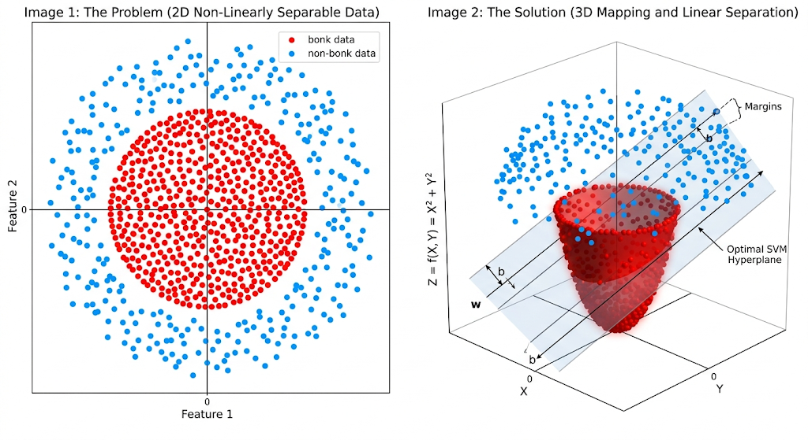

# Course 2 — Lesson 6 — Support Vector Machines & The Kernel Trick

To tie this back to our **algorithm toolbox**, Support Vector Machines (SVMs) belong to the **Equation Family**. Like logistic regression and neural networks, they use continuous math and the linear form $\mathbf{w} \cdot \mathbf{x} + b$ to draw decision boundaries through your data. The way an SVM decides *where* that boundary goes — and how it goes from drawing one straight line to bending boundaries through nonlinear shapes — is what makes it distinct.

This lesson is structured as a build-up:

1. **The geometric idea** — maximize the **margin** ("widest street").
2. **The primal math** — write that idea as an optimization problem.
3. **Realism patches** — **hinge loss** and **soft margins** (the $C$ knob).
4. **A fork in the road** — once the problem is written, it can be solved **two distinct ways**: the **Primal Path** or the **Dual + Kernel Path**. They give the same answer on linear problems, but they have very different operational profiles, and **only the dual path unlocks the kernel trick**.
5. **Inside the dual** — the Lagrangian derivation and where sparsity comes from.
6. **The kernel trick** — where SVMs stop being "only geometry" and become a famously efficient way to capture **nonlinear** boundaries.
7. **Production view** — how the math collapses into a tiny, fast serialized model at inference.
8. **Big data vs nonlinear boundaries** — where both paths fail individually, why industry often pivots outside the equation family — and **kernel approximation** (`RBFSampler` + `LinearSVC`) when you still need margins in bulk.

---

## Part 1: The maximum-margin classifier (intuition)

Imagine plotting cycling data on a 2D graph: **power** on the *x*-axis and **cadence** on the *y*-axis. Rides where you **bonked** are red dots; rides where you **felt great** are blue dots.

Your goal is to draw a **straight line** that **perfectly separates** red from blue.

When there is a clear gap between the clusters, there is not just one line that works — there are **infinitely many**. You could hug the red cluster, hug the blue cluster, or pick some diagonal. **Logistic regression** picks a boundary by minimizing log loss; that boundary can end up **uncomfortably close** to one cluster, because every single point in the dataset gets a vote on where the line lands. An **SVM** asks a different question:

> Which line gives us the **widest possible margin of safety**?

### The "street" analogy

Instead of only a thin separator, think of an SVM as trying to paint a **wide, multi-lane "street"** between the clusters.

- The **center line** of the street is the **decision boundary** (the actual classifier).
- The **outer edges** (the shoulders) grow until they **touch** the closest red point on one side and the closest blue point on the other.

The algorithm **rotates and shifts** this street until the **width** of the corridor is as large as geometry allows. That is **maximizing the margin**.

### What are "support vectors"?

In a dataset of **10,000** historical rides, the striking fact is that an SVM effectively **ignores almost all** of the points.

- It does not need the deep-interior red points (huge bonks far inside the red region).
- It does not need the deep-interior blue points (easy rides far inside the blue region).

It **only** needs the points that sit **on the boundary** between the two groups — those that **lie on the outer edges** of the margin street.

Those boundary-touching points are the **support vectors**. They act like **pillars** holding up the edges of the street. If you deleted the other **9,996** points and kept **only** the support vectors, the SVM would place the **same** boundary, because **only those points** constrain the margin. Hence the algorithm's name.

---

## Part 2: The math of the street (the primal formulation)

Because an SVM draws a **straight line** (or a **flat plane** in higher dimensions), it uses the familiar **linear** form — just written with **vectors**.

We're going to write the geometric idea as an **optimization problem**. The form below is called the **primal** because the variables are the *primary* geometric objects ($\mathbf{w}$ and $b$) that *define* the street. Later, we'll see a different way to write the *same* problem (the **dual**), and that's what unlocks the kernel trick.

### 1. The equation of the street

**Center line (decision boundary):**

$$
\mathbf{w} \cdot \mathbf{x} + b = 0
$$

Here $\mathbf{w}$ is the **weight vector** (direction perpendicular to the boundary), $\mathbf{x}$ is a **data point** in feature space (e.g., power and cadence as coordinates), and $b$ is the **bias** (shifts the boundary).

**The two edges (shoulders of the street):**

The SVM does not stop at one line — it defines the **two parallel margins** where support vectors can sit.

- **Positive class** (e.g., bonk):  
  $$\mathbf{w} \cdot \mathbf{x} + b = 1$$
- **Negative class** (e.g., no bonk):  
  $$\mathbf{w} \cdot \mathbf{x} + b = -1$$

### 2. Maximizing the margin

Geometrically, the **distance between** the $+1$ and $-1$ hyperplanes is:

$$
\frac{2}{\lVert \mathbf{w} \rVert}
$$

where $\lVert \mathbf{w} \rVert$ is the **length** (Euclidean norm) of $\mathbf{w}$.

So the objective is clear: to make the street **as wide as possible**, maximize $\frac{2}{\lVert \mathbf{w} \rVert}$ — equivalently, **minimize** $\lVert \mathbf{w} \rVert$ (subject to constraints that keep the data outside the margin). It's mathematically convenient to minimize the **squared** norm:

$$
\min_{\mathbf{w},\, b} \;\; \frac{1}{2}\lVert \mathbf{w} \rVert^2
$$

### 3. The hard-margin constraint

The optimizer cannot simply drive $\mathbf{w} \to \mathbf{0}$ — a zero weight vector would blow up the width meaninglessly and violate separation. We pin the problem down with a **hard rule**: **no training point may fall inside the strip** between the two margins. With binary labels $y_i \in \{+1,-1\}$:

$$
y_i \left( \mathbf{w} \cdot \mathbf{x}_i + b \right) \ge 1 \quad\text{for every }i
$$

**Reading it:** $y_i$ times the signed distance-from-boundary score must be **at least 1**, so each point is **on its class's margin or farther** — never in the "wrong lane."

This combination — minimize $\frac{1}{2}\lVert\mathbf{w}\rVert^2$ subject to one inequality per training point — is the **hard-margin primal SVM**.

---

## Part 3: Hinge loss (the same idea, written as a loss function)

The constraint above can also be written as a **loss function** — the form most ML engineers recognize. For each training point, define the **hinge loss**:

$$
L_{\text{hinge}}(\mathbf{x}_i, y_i) \;=\; \max\!\bigl(0,\; 1 - y_i(\mathbf{w}\cdot\mathbf{x}_i + b)\bigr)
$$

The mechanic:

- If the point sits **safely outside** the margin on the correct side, then $y_i(\mathbf{w}\cdot\mathbf{x}_i + b) \ge 1$, so $1 - y_i(\mathbf{w}\cdot\mathbf{x}_i + b) \le 0$, and the $\max(0,\,\cdot)$ clamps the loss to **exactly zero**.
- If the point sits **inside the street** or on the wrong side, the loss is positive, growing **linearly** with how badly the margin is violated.

This is where the **sparsity** of SVMs comes from at the loss level. Logistic regression uses log loss, which is **always positive** — every point nudges the model. Hinge loss says **"you're outside the street? You contribute nothing."** Only the points on the margin or in violation generate a non-zero loss — and those are the **support vectors**. The same fact will reappear from a completely different angle when we derive the dual (Part 5).

To see how the **two margin lines** emerge in practice, flip the mental model: the algorithm does not “draw” the margins from the points in one stroke. It **proposes** a boundary (weights $\mathbf{w}$ and bias $b$), lets the **hinge loss** score how bad that proposal is, then **updates** $\mathbf{w}$ and $b$ to improve the score. Iteration by iteration, that process **finds** the street.

Think of the hinge as the **judge**. For **every** training point it asks a single question: *Are you **safely outside** the street on the **correct** side?*

In symbols, for one point:

$$
\text{Loss} = \max\bigl(0,\; 1 - y_i \times \text{Score}\bigr)
$$

- **Score:** the raw classifier output $\mathbf{w}\cdot\mathbf{x}_i + b$ (in 2D: $w_1 x_1 + w_2 x_2 + b$).
- **$y_i$:** the true label, in $\{+1,-1\}$.

**Reading the math:** if $y_i \times \text{Score} > 1$, the margin is satisfied, so $1 - y_i \times \text{Score} < 0$ and $\max(0,\,\cdot)$ clamps the penalty to **0**. If $y_i \times \text{Score} < 1$, the point is inside the street or on the wrong side — the loss is **positive** and grows as the violation worsens.

### A three-point walk-through

Take a toy 2D dataset with features $(x_1, x_2)$:

| Point | Location | Label |
|---|---|---|
| **1** | $(2, 2)$ | $+1$ |
| **2** | $(-2, -2)$ | $-1$ |
| **3** | $(0, 0.5)$ | $+1$ (sits near the middle of the plot — the “troublemaker”) |

Suppose the model’s current guess is $w_1 = 0.5$, $w_2 = 0.5$, $b = 0$. That defines a **diagonal** decision boundary. Hinge loss on each point:

**1. Point 1** $(2,2)$, $y = +1$

- Score: $0.5(2) + 0.5(2) + 0 = 2.0$
- $1 - (+1)(2.0) = -1.0$
- Loss: $\max(0, -1.0) = 0$ — **safe** (correct side, beyond the margin).

**2. Point 2** $(-2,-2)$, $y = -1$

- Score: $0.5(-2) + 0.5(-2) + 0 = -2.0$
- $1 - (-1)(-2.0) = 1 - 2.0 = -1.0$
- Loss: $\max(0, -1.0) = 0$ — **safe** on the other side.

**3. Point 3** $(0, 0.5)$, $y = +1$

- Score: $0.5(0) + 0.5(0.5) + 0 = 0.25$
- $1 - (+1)(0.25) = 0.75$
- Loss: $\max(0, 0.75) = 0.75$ — correct side of the **center line** (Score $> 0$), but **inside the street** (Score $< 1$): partial penalty.

**Total hinge loss for this guess:** $0 + 0 + 0.75 = 0.75$.

### How the margins are “found”

An **optimization** routine uses that total (often summed over the whole dataset, plus the weight penalty you’ll see with soft margins) and asks: can we change $w_1$, $w_2$, or $b$ to make the total **smaller**? In repeated small steps it **tilts and shifts** the street. Moving to rescue Point 3 might pull Point 2 into the margin and **raise** the penalty — the solver balances those trade-offs. The **learned** margins are nothing mystical: they are wherever $\mathbf{w}$ and $b$ land when **total hinge loss** (plus regularization) is driven **as low as the data allow**. In code, hinge SVMs commonly use **sub-gradient** or **coordinate** style updates, because the hinge is piecewise linear (not differentiable at the “hinge”), but the story matches the picture: **nudge the line until the judge’s score is minimal.**

---

## Part 4: Soft margins — handling messy data with $C$

The hard-margin constraint demands perfect separability. Real data rarely cooperates: a single bad sensor reading can put one blue dot deep inside the red zone, and a hard-margin SVM would either twist itself into a razor-thin sliver or simply fail to find a feasible solution. That's classic **overfitting / high variance** territory.

**Soft-margin SVM** relaxes the constraint: we accept that some points may sit inside the street or even on the wrong side, and we **pay a penalty** for each violation.

### Slack variables $\xi$

Introduce a **slack variable** $\xi_i \ge 0$ for each training point ($\xi$, pronounced "Xi"). It measures how much that point breaks the margin rule:

- If a point is safe outside the margin: $\xi_i = 0$.
- If a point trespasses into the street or crosses sides: $\xi_i$ is exactly *how far* it trespassed (in margin-units).

The constraint becomes:

$$
y_i(\mathbf{w}\cdot\mathbf{x}_i + b) \;\ge\; 1 - \xi_i, \qquad \xi_i \ge 0
$$

### The $C$ hyperparameter

We add the total slack into the objective, scaled by a hyperparameter $C$:

$$
\min_{\mathbf{w},\, b,\, \boldsymbol{\xi}} \;\;
\frac{1}{2}\lVert \mathbf{w} \rVert^2
\;+\; C \sum_{i=1}^{n} \xi_i
$$

$C$ is the **volume knob on the penalty for errors**:

- **High $C$ (strict):** big penalty for slack. The optimizer tightens the street to avoid mistakes — closer to **hard margin**, more variance, prone to overfitting.
- **Low $C$ (relaxed):** small penalty for slack. The optimizer happily accepts misclassifications to keep the street **wide and stable** — more bias, better generalization on noisy data.

$C$ is one of the two hyperparameters you'll spend the most time tuning on an SVM (the other being the kernel choice, coming up).

So far our **three-point** walk-through in Part 3 only tallied raw **hinge loss**. A trained SVM, though, balances **two tensions**:

1. **Keep the corridor clear** — drive hinge penalties down (don’t tolerate points wandering into the margins).
2. **Keep the street wide** — don’t inflate $\mathbf{w}$; recall that margin width behaves like $\propto 1/\lVert \mathbf{w} \rVert$, so shrinking $\lVert\mathbf{w}\rVert$ widens the gap between the $\pm 1$ planes **when separation is achievable**.

The hyperparameter **$C$ negotiates between them**. One standard way to **grade** an $(\mathbf{w},\, b)$ guess in code-shaped intuition is:

$$
\text{Total Cost}
\;=\;
\frac{1}{2}\lVert \mathbf{w} \rVert^2
\;+\;
C \times (\text{Total Hinge Loss over training points})
$$

(That matches **Primal-view** hinge training: quadratic **weight shrinkage** plus **scaled sum of hinges** — it is the sibling of writing slack variables explicitly; see the boxed objective earlier in this section.)

### Re-using the Part 3 guess

Take again $w_1 = 0.5$, $w_2 = 0.5$, $b = 0$:

- **Point 1** $(2,2)$, $y=+1$ — hinge loss **0**.
- **Point 2** $(-2,-2)$, $y=-1$ — hinge loss **0**.
- **Point 3** $(0, 0.5)$, $y=+1$ — hinge loss **0.75** (correct side of the center line but **inside** the margin strip).

So **total hinge loss on these three rows** — for illustration only — is **0.75**.

**Step 1 — “Margin cost” (the width knob):**

$$
\text{Margin cost} \;=\; \frac{1}{2}(w_1^2 + w_2^2)
\;=\; \frac{1}{2}(0.5^2 + 0.5^2)
\;=\; \frac{1}{2}(0.5)
\;=\; 0.25.
$$

Now watch **Total Cost** when $C$ changes.

### Scenario 1: High $C$ ($C = 10$) — the strict judge

A large $C$ screams: **“I hate stray points inside the street — multiply every hinge penalty by ten.”**

$$
\text{Total Cost}
= 0.25 + 10 \times 0.75
= 0.25 + 7.5 = 7.75.
$$

Total cost dominates from the hinge term (**7.5**). The optimizer is pressured to twist $\mathbf{w}$ and sweep $b$ until Point 3 climbs back past the margin—or pay an enormous hinge bill—often tightening or contorting geometry in ways that rhyme with **hard-margin** zeal and **high-variance / overfitting** when outliers bully the boundary.

### Scenario 2: Low $C$ ($C = 0.1$) — the relaxed judge

A small $C$ says: **“A few tolerated intrusions beat bloating weights and crashing the corridor width.”**

$$
\text{Total Cost}
= 0.25 + 0.1 \times 0.75
= 0.25 + 0.075 = 0.325.
$$

Here the hinge slack is dirt cheap (**0.075**). Fighting Point 3 aggressively would crank $\frac{1}{2}\lVert\mathbf{w}\rVert^2$ toward values like $2.0$ or $3.0$—easily wiping out any hinge savings. Mathematically **it can be cheaper to pay the small hinge tax** than **narrow the avenue** chasing perfect separation—the soft-margin hallmark: **living with** a troublemaker beats **redrawing civilization** around one sensor glitch. (Same spirit as accepting a modest parking ticket instead of bulldozing a new street.)

---

## Part 5: A fork in the road — Primal Path vs Dual + Kernel Path

Up to now we've described **what** to optimize:

$$
\min_{\mathbf{w},\, b,\, \boldsymbol{\xi}} \;\;
\frac{1}{2}\lVert \mathbf{w} \rVert^2 + C \sum_i \xi_i
\quad\text{s.t.}\quad
y_i(\mathbf{w}\cdot\mathbf{x}_i + b) \ge 1 - \xi_i,\ \xi_i \ge 0
$$

**How** you actually solve it is where SVMs split into two **genuinely distinct approaches**. They produce the same boundary on a *linear* problem, but they have completely different operational profiles, and **only one of them supports the kernel trick**. In code, they correspond to different scikit-learn classes — when you build the model, you pick **one**, not both.

### Approach A — The Primal Path (direct)

**Idea:** treat the problem above as written. Use an iterative optimizer (e.g. coordinate or sub-gradient descent) to update $\mathbf{w}$ and $b$ directly until the loss stops moving.

- **Variables optimized:** $\mathbf{w}, b, \boldsymbol{\xi}$ — the geometric objects.
- **Memory cost:** scales with the number of **features**, not the number of training points. Easy on RAM.
- **Boundary shapes:** **linear only** in the original feature space. To get nonlinear boundaries here, you'd have to explicitly construct a high-dimensional feature map $\phi(\mathbf{x})$ — which is exactly the explosion the kernel trick exists to avoid.
- **Best for:** **huge** datasets (millions of rows) where a flat separator is appropriate.
- **scikit-learn class:** `sklearn.svm.LinearSVC()`.

### Approach B — The Dual + Kernel Path (indirect)

**Idea:** rewrite the *same* optimization problem in terms of a different set of variables — one **multiplier** $\alpha_i$ per training point — using **Lagrangian multipliers**. The math (Part 6) collapses the dependence on raw coordinates into something cleaner: the algorithm only needs **dot products between pairs of training points**. That's the loophole that opens the door to the **kernel trick**.

- **Variables optimized:** $\alpha_1, \ldots, \alpha_n$ — one per training example, with $0 \le \alpha_i \le C$ (the **box constraint**, where the same $C$ from Part 4 reappears as the upper bound).
- **Memory cost:** scales with $n^2$ — the optimizer needs the **Gram matrix**, an $n \times n$ table of all pairwise inner products. Heavy on RAM, and the wall you hit on big datasets.
- **Boundary shapes:** **linear or nonlinear**, depending on which **kernel** you plug in (Part 7).
- **Best for:** **small / medium** datasets (thousands to tens of thousands of rows) with **complex, nonlinear** decision boundaries.
- **scikit-learn class:** `sklearn.svm.SVC()`.

### Side-by-side

|  | **Primal Path** | **Dual + Kernel Path** |
|---|---|---|
| Variables optimized | $\mathbf{w}, b, \boldsymbol{\xi}$ | $\alpha_1, \ldots, \alpha_n$  (with $0 \le \alpha_i \le C$) |
| Solver style | gradient / coordinate descent | quadratic programming (e.g. SMO) |
| Memory bottleneck | $O(\text{features})$ | $O(n^2)$ Gram matrix |
| Boundary shapes | **linear only** | linear **or** nonlinear (any kernel) |
| Sweet spot | $n$ in the millions, linear OK | $n$ in the thousands, complex shapes |
| Kernel trick available? | **No** | **Yes** |
| scikit-learn class | `LinearSVC` | `SVC` |

Mathematically the two paths reach the same optimum on a linear problem (strong duality holds for this convex program). **Operationally** they are different products that you choose between. The remainder of the lesson follows the **Dual + Kernel Path**, because that's where the interesting machinery — and the kernel trick — lives.

---

## Part 6: Inside the Dual Path — the Lagrangian derivation

When you must **minimize** a function while staying inside **inequality** constraints, a standard tool is **Lagrangian multipliers**. Instead of treating the objective and the constraints as two separate puzzles, you **fold** the constraints into one expression.

Introduce a multiplier $\alpha_i \ge 0$ for each training-point constraint: it measures how much "pressure" that constraint exerts at the optimum (roughly: penalty for sitting on or violating the margin).

The **Lagrangian** (primal variables $\mathbf{w}, b$; multipliers $\alpha_1,\ldots,\alpha_n$) for the hard-margin case is:

$$
L(\mathbf{w}, b, \boldsymbol{\alpha}) \;=\;
\frac{1}{2}\lVert \mathbf{w} \rVert^2
\;-\; \sum_{i=1}^{n} \alpha_i \Bigl[\, y_i(\mathbf{w} \cdot \mathbf{x}_i + b) - 1 \,\Bigr]
$$

Take partials with respect to $\mathbf{w}$ and $b$, set them to zero (stationarity), solve, and substitute back. After the algebra clears, the problem can be written **only** in terms of the multipliers:

$$
\max_{\boldsymbol{\alpha}} \;\;
\sum_{i=1}^{n} \alpha_i
\;-\; \frac{1}{2} \sum_{i=1}^{n} \sum_{j=1}^{n}
  \alpha_i \alpha_j \, y_i y_j \, (\mathbf{x}_i \cdot \mathbf{x}_j)
$$

subject to KKT conditions: $\sum_i \alpha_i y_i = 0$, and (in the **soft-margin** case) $0 \le \alpha_i \le C$ — the **box constraint**, where the $C$ from Part 4 reappears as the upper bound on each multiplier.

**Three things to notice:**

1. **The pairwise term $(\mathbf{x}_i \cdot \mathbf{x}_j)$.** The dual no longer references raw coordinates point-by-point. It only cares about how each example **relates** to every other example, summarized as an inner product.
2. **Sparsity falls out of the math.** For most indices $i$, the optimal $\alpha_i$ is **exactly zero**, so those points drop out of the solution. The points with $\alpha_i > 0$ are precisely the **support vectors**. The hinge-loss view (Part 3) and the Lagrangian-multiplier view (here) are two windows onto the same fact.
3. **The kernel hook.** Because the entire dual depends on $\mathbf{x}_i \cdot \mathbf{x}_j$ — *only* on inner products — we can swap in any function $K(\mathbf{x}_i, \mathbf{x}_j)$ that behaves like an inner product in some richer space. That's the kernel trick.

> **Sidebar — worth a separate study session:** Deriving the dual from the soft-margin primal, including the box-constraint result $0 \le \alpha_i \le C$, is a rite of passage in classical ML. Add it to your math sidebars: *"Derive the SVM dual from the soft-margin primal using Lagrangian multipliers and prove the box constraint."*

### The hidden balance rule: $\sum_i \alpha_i y_i = 0$

Above we listed $\sum_{i=1}^n \alpha_i y_i = 0$ as one of the **KKT** side conditions glued to the dual. It deserves emphasis: weighted by labels, every feasible $\boldsymbol{\alpha}$ must sit on a **balanced hyperplane**.

For example, reuse **Part 7’s three-point 1D layout** with $y = (+1,\,-1,\,+1)$:

$$
\alpha_1 (+1) + \alpha_2 (-1) + \alpha_3 (+1) \;=\; 0.
$$

**Intuition.** Think of signed contributions $\alpha_i y_i$: points with label $+1$ **pull**, points with label $-1$ **push** in the bookkeeping of the stationary conditions on $b$. The sum forcing **exactly zero** keeps the separating geometry from sliding off with an arbitrary offset—there is nowhere for the corridor to drift while remaining consistent with Lagrangian optimality **and** the bias term handled in the primal.

**Why naive “one-$\alpha$ at a time” updates break.** Picture a loop that says: *“If I raise $\alpha_1$ from $0$ to $0.5$, the dual objective looks better—done.”* The instant you do that **alone**, the sum $\sum_i \alpha_i y_i$ picks up an unbalanced **$+0.5$** (with the other $\alpha$’s held fixed). You are **no longer dual-feasible**; the KKT story and the closed-form link back to $b$ and $\mathbf{w}$ fall apart. **No single $\alpha_i$ can move in isolation** without either fixing the rest or compensating.

**SMO — Sequential Minimal Optimization.** In 1998, **John Platt** (Microsoft Research) published **SMO** [Platt, *Fast Training of Support Vector Machines using Sequential Minimal Optimization*, MSR-TR-98-14] to remove exactly this blocker. The idea: each step **chooses a pair** of indices $(i,\, j)$, **freezes** every other $\alpha_k$, and adjusts **only** $(\alpha_i,\, \alpha_j)$ so that $\sum_k \alpha_k y_k$ stays **zero** while improving the dual objective.

Concretely, with our Part 7 labels $y_1=+1$ and $y_2=-1$, if you increase $\alpha_1$ by $\delta$, the balance $\alpha_1 y_1 + \alpha_2 y_2$ changes by $+\delta$ from the first term unless you also change $\alpha_2$. Increasing $\alpha_2$ by the **same** $\delta$ contributes $y_2\,\delta = -\delta$ to the sum—**net zero**—so the pair move **together** up the dual while honoring $\sum \alpha_i y_i = 0$. (With a third active $\alpha$, the algebra is still a **two-parameter** tweak on one edge of the feasible simplex—that is why **pairs**, not lone coordinates, are the atomic move.)

Engines behind many production SVMs—including **LIBSVM**, which **`sklearn.svm.SVC`** wraps—are descended from **this** pairwise, constraint-respecting playbook rather than unrestricted coordinate-wise chaos on lone $\alpha$’s.

> **Hands-on.** Pair this section with an **interactive SMO toy**: drag individual $\boldsymbol{\alpha}$ components by hand and watch $\sum_i \alpha_i y_i$ leave zero; then switch **“SMO-style” paired updates** to see how coupling two multipliers restores feasibility while chasing the optimum. *[Add your simulator/embed link beside the lesson when you ship it.]*

---

## Part 7: The kernel trick — Path B's superpower

This is where Support Vector Machines stop feeling like a **simple geometric rule** ("draw the widest street") and become **mathematically powerful**: by swapping the dot product for a **kernel**, the dual lets us **bend** separation into rich, nonlinear boundaries — **without** paying the full price of explicitly living in gigantic feature spaces.

### The problem: unsplittable data

We established that an SVM draws a **straight line** (or flat plane). Real data often **won't cooperate**.

Picture your cycling scatter again: **power** vs **cadence**. Suppose every red **Bonk** ride sits in a tight blob **at the center** of the plot, while every blue **No Bonk** ride forms a **ring** wrapping around that center.

No matter how you swivel a ruler on that 2D page, **one straight cut** cannot separate **inside blob** from **outside ring**. A plain **linear** classifier is ruled out — not because "ML is magic," but because the **true boundary** isn't linear in those two axes.

### The geometric fix: project into a higher dimension

If separation fails in 2D, change the geometry — **not** the story you tell about cyclists, but the **coordinate system** where a linear separator becomes possible.

Imagine the scatter printed on **flexible rubber** lying flat on the table. Add a mapping rule tied to geometry: **the closer** a ride is **to the center**, **the farther** its image is lifted **above** the rubber in a new direction (a genuine **third axis**).

- The interior **Bonk** points rise into a sharp **summit**.
- The **No Bonk** ring stays nearer the table.

Now a **flat sheet** — a genuine **affine plane** in 3D — can slide **between** the uplifted reds and the flatter blues. That plane is linear in the **embedded** coordinates: it separates what was **inseparable** along straight lines in the flat 2D plot.

Viewed back down onto the rubber, the silhouette of where that plane intersects reality traces out the **curve** — here, intuitively circular — that we needed all along. You've separated **circle vs center** while still using **linear separation**, but **after** embedding.



*Figure:* Lift the scatter with \(Z = f(X,Y) = X^2 + Y^2\) so a **hyperplane** in 3D (with margins) can separate what was inseparable along straight boundaries in Features 1 and 2 alone.

### The trick: skip the embedding, compute the inner product

Embedded spaces sound great — and then **engineering reality** hits.

If we actually **constructed** lifted coordinates explicitly for millions of riders in 10,000 dimensions, we'd drown CPU and RAM calculating and storing gigantic vectors. Plain matrix code would crater. For the **RBF kernel** below, the implicit space is even **infinite-dimensional** — you literally cannot materialize it.

This is exactly where the dual path pays off. Look once more at the dual's pairwise term:

$$
\dots \;-\; \frac{1}{2} \sum_{i=1}^{n} \sum_{j=1}^{n}
  \alpha_i \alpha_j \, y_i y_j \, \mathbf{(\mathbf{x}_i \cdot \mathbf{x}_j)}
$$

The optimization only ever asks: *what is the dot product between two points?* It never asks for individual coordinates. So we **rip out** $\mathbf{x}_i \cdot \mathbf{x}_j$ and replace it with a **kernel function** $K(\mathbf{x}_i, \mathbf{x}_j)$ that returns *what the dot product would be in the embedded space* — without ever materializing the embedded coordinates.

> *A kernel answers the question:* if I implicitly embedded every point into a richer space, what would the inner product between these two images be?

The decision boundary you see in the original feature plot can look **wildly nonlinear**, while the algorithm's heavy lifting still looks like **pairwise kernel evaluations** instead of "allocate the universe."

### The most common kernels in code

When you fit an SVM with `SVC()` in scikit-learn, you pick a kernel — the **geometry** in the embedded view that matches the **shape** of your cluster boundaries.

- **Linear kernel:** $K(\mathbf{x}_i, \mathbf{x}_j) = \mathbf{x}_i \cdot \mathbf{x}_j$. No embedding trick — the dual still works, but you stay in the original feature space. (At this point you should usually just use `LinearSVC` from the Primal Path; it's faster on big data.)
- **Polynomial kernel:** $K(\mathbf{x}_i, \mathbf{x}_j) = (\mathbf{x}_i \cdot \mathbf{x}_j + c)^d$. Encodes interactions up to degree $d$ — boundaries can flex into curved regions (bowls, bends) without hand-engineering every monomial.
- **RBF (Gaussian) kernel:** $K(\mathbf{x}_i, \mathbf{x}_j) = e^{-\gamma\, \lVert \mathbf{x}_i - \mathbf{x}_j \rVert^2}$. The famous default for many nonlinear problems. Corresponds to an implicit feature map into an **infinite-dimensional** space (a particular reproducing-kernel Hilbert space). Lets the model place **highly localized** influence around support points and stitch together flexible decision regions — at the cost of careful regularization (the $C$ knob plus $\gamma$) so you don't memorize noise.

### Worked toy: the dual with a linear kernel on a 1D line

To see how the **dual** behaves in practice, strip away high-dimensional clutter: one feature axis only, and a **linear kernel** $K(x_i, x_j) = x_i x_j$ (in 1D, the dot product is just **multiplication**).

| Point | Role (intuition) | Position $x_i$ | Label $y_i$ |
| :--- | :--- | :---: | :---: |
| **1** | The anchor | $1$ | $+1$ |
| **2** | The opposite-class neighbor | $-1$ | $-1$ |
| **3** | Same label as Point 1, but farther out | $3$ | $+1$ |

The story: Points **1** and **2** sit on opposite sides of the origin and **bracket** where a separating threshold should live; Point **3** is a same-side **bystander** far to the right.

**Step 1 — Gram matrix (raw similarity $x_i x_j$).** Build every pairwise product (here, $K_{ij} = x_i x_j$):

| $x_i \cdot x_j$ | Point 1 ($x=1$) | Point 2 ($x=-1$) | Point 3 ($x=3$) |
| :--- | :---: | :---: | :---: |
| **Point 1** ($x=1$) | $1$ | $-1$ | $3$ |
| **Point 2** ($x=-1$) | $-1$ | $1$ | $-3$ |
| **Point 3** ($x=3$) | $3$ | $-3$ | $9$ |

Point **1** and Point **3** share a **positive** inner product (**3**) — same direction along the line. Point **1** and Point **2** have inner product **$-1$** — opposite directions from the origin.

**Step 2 — The label weighting $y_i y_j (x_i \cdot x_j)$.** The dual’s pairwise term uses $y_i y_j\, K_{ij}$. Two representative pairs:

- **Points 1 & 2 (opposite labels, “tension”).** Similarity $x_1 x_2 = -1$. Label factor $y_1 y_2 = (+1)(-1) = -1$. Product: $(-1)\times(-1) = \mathbf{+1}$. In the maximization story, conflict pairs with **negative** geometry can contribute **positive** signed mass inside the quadratic piece—exactly where the optimizer must spend $\alpha$ budget to **pin down** the boundary between near-adversarial neighbors.

- **Points 1 & 3 (same label, “allies”).** Similarity $x_1 x_3 = 3$. Label factor $y_1 y_3 = (+1)(+1) = +1$. Product: $\mathbf{+3}$. That term enters the **subtracted** $\frac{1}{2}\sum_i\sum_j \alpha_i\alpha_j y_i y_j K_{ij}$ block: cranking up **both** $\alpha_1$ and $\alpha_3$ buys little geometric leverage (Point 3 is **not** between the classes) but **inflates** the penalty. The optimal solution often **pushes $\alpha_3$ to zero**—the bystander is **redundant** once Point 1 already “covers” that side.

**Step 3 — Illustrative $\alpha$ after optimization.** Picture the solver finishing with:

$$
\alpha_1 = 0.5 \quad\text{(support vector)}, \qquad
\alpha_2 = 0.5 \quad\text{(support vector)}, \qquad
\alpha_3 = 0 \quad\text{(inactive — not a support vector)}.
$$

Point **3** drops out: it lies safely **beyond** Point **1** relative to the cut; attributing mass to $\alpha_3$ would mostly **re-stoke** the expensive $(1,3)$ ally cross-term without sharpening the separator between **1** and **2**. (Exact numeric $\alpha_i$ depend on $C$ and solver scaling; this snapshot matches the geometry of **only the flanking pair** carrying the margin.)

**Step 4 — Recover the primal weight $w$ (linear kernel).** For a linear kernel, the standard aggregation is

$$
w \;=\; \sum_{i=1}^{3} \alpha_i\, y_i\, x_i
\;=\; (0.5)(+1)(1) + (0.5)(-1)(-1) + (0)(+1)(3)
\;=\; 0.5 + 0.5
\;=\; \mathbf{1}.
$$

With **$b = 0$** (consistent with a symmetric hard-margin placement between $x=-1$ and $x=1$), the decision score is $\operatorname{sign}(w x + b) = \operatorname{sign}(x)$: threshold at **$x = 0$**, **between** Point **2** and Point **1**, while Point **3** is classified correctly but contributes **nothing** to the support set. That is the dual path in miniature: **Gram matrix $\to$ weighted interactions $\to$ sparse $\alpha$ $\to$ a concrete line in original space.**

---

## Part 8: The Architect's view — inference and serialization

How does this heavy training math translate into a fast production system? It comes back to the **sparsity** that hinge loss and the dual path created.

When training finishes, every point with $\alpha_i = 0$ disappears from the prediction equation. The **inference** rule for a new ride $\mathbf{x}_{\text{new}}$ is:

$$
f(\mathbf{x}_{\text{new}}) \;=\;
\operatorname{sign}\!\left(\;
\sum_{i=1}^{n} \alpha_i\, y_i\, K(\mathbf{x}_i, \mathbf{x}_{\text{new}}) \;+\; b
\;\right)
$$

Read it carefully: the prediction is a **sum over training points**, each scaled by its multiplier $\alpha_i$ and the kernel similarity to $\mathbf{x}_{\text{new}}$. But for almost all $i$, $\alpha_i = 0$ — so almost every term in the sum is **literally zero**.

### The data-trimming side effect

When you call `model.fit()` in scikit-learn, the very last thing the solver does before handing the model back is:

> **discard every training row where $\alpha_i = 0$.**

The serialized model file — the `.pkl` or `.joblib` you ship to production — contains **only the support vectors** (and their $\alpha_i$, $y_i$, the bias $b$, and the kernel choice). A 500 MB training set can shrink to a **2 MB model artifact**, because everything that didn't survive sparsity is gone.

At inference time, the loop runs only over the surviving support vectors. Real-time prediction is the cost of a few hundred (sometimes a few thousand) kernel evaluations — fast and predictable, regardless of how big the original dataset was.

This is the elegance hidden inside the math: hinge loss said *"ignore the safe points,"* the Lagrangian formalized that as $\alpha_i = 0$, and production reaps the reward as a **tiny, fast model**.

---

## Part 9: The scale wall, kernel approximation, and nonlinear boundaries at enormous $n$

If you need **many millions** of rows *and* a **highly complex, nonlinear** boundary, vanilla SVM tooling hits a structural wall rather than just a tuning problem:

- **The Primal Path** (`LinearSVC`) happily scales to tens of millions of rows — but in the original feature space it is still a **hyperplane**. It separates with a **straight** boundary unless you enrich the coordinates first.
- **The Dual Path** (`SVC` with nonlinear kernels) can produce **complex curves**, but classic training boils down to an $n \times n$ Gram matrix of kernel values between pairs. For $n = 10^7$, **naively** storing dense float entries for $10^7 \times 10^7$ pairwise comparisons blows past **hundreds of terabytes** before you finish the first conceptual "epoch." In practice you'll never assemble that matrix; the dual route is capped at **much smaller $n$.**

So in industry, for **massive + nonlinear**, teams often abandon classical SVMs and switch toward the **Rule Family** (**XGBoost** / **LightGBM**) — or toward **deep learning** (**neural networks**). Those toolchains are engineered for nonlinear decision surfaces at enormous $n$.

The exception that keeps SVM-ish thinking alive for big data lives in compliance-driven or interpretation-sensitive designs where teams still insist on something that looks **explicitly geometric** — a boundary with **margins**. There is then a famously clever hack: approximate the kernel once in **feature space**, then solve **linear** SVM **primal**.

### Mental model — a finite-dimensional "fake" lift

You want intuition like the infinite-dimensional lift behind the **RBF** kernel — but want **primal scalability** ($n \times D$ data, streamed in batches) instead of the dual's killer $n \times n$ object.

Rather than optimizing multipliers $\alpha_i$ inside the dual, you **pre-transform** $\mathbf{x}$ into a deliberately high-but-**finite** vector $Z(\mathbf{x}) \in \mathbb{R}^D$ (say $D = 5{,}000$). After that mapping, $\mathbf{z} = Z(\mathbf{x})$ is ordinary tabular columns: you enlarge the dataset from **$d$** original dimensions to **`D`** engineered features.

You then pass that widened matrix to **Primal Path** machinery (`LinearSVC`). Optimizer-wise, it is still minimizing hinge loss plus regularization against a plain linear score $\mathbf{w}^\top \mathbf{z} + b$ — a **hyperplane** in $D$-dimensional **mapped** coordinates. Mapped back visually to two original axes, that hyperplane reads as **richly nonlinear curvature** — the same trick you pictured with embedding in Part 7, except $D$ is chosen so the matrix algebra stays finite and batchable.

### Rigorous math sketch — Random Fourier Features (Kitchen Sinks)

How do random cosines imitate the RBF kernel?

**Random Fourier Features** — [Rahimi & Recht, 2007](https://arxiv.org/abs/0711.0586) (*Random Features for Large-Scale Kernel Machines*, also known informally as Random Kitchen Sinks) — build from **Bochner's theorem** in harmonic analysis: roughly, shift-invariant, positive definite kernels — the Gaussian RBF is the canonical textbook case — relate to Fourier transforms of a probability distribution. Sampling from that spectral viewpoint yields randomized basis functions whose dot products approximate exact kernel evaluations.

Rough goal: explicit random maps $Z(\cdot)$ such that inner products mimic the Gaussian RBF kernel:

$$
K(\mathbf{x}, \mathbf{y}) = e^{\,-\gamma\, \lVert \mathbf{x} - \mathbf{y} \rVert^2}, \quad
Z(\mathbf{x})^\top Z(\mathbf{y}) \approx K(\mathbf{x}, \mathbf{y}).
$$

Construct one randomized feature indexed by sampled frequency $\boldsymbol{\omega}$ and phase $b$, with cosine nonlinearity (schematic sketch used in approximation theory):

$$
z_{\boldsymbol{\omega},\, b}(\mathbf{x}) =
\sqrt{\frac{2}{D}} \cos\left( \boldsymbol{\omega}^\top \mathbf{x} + b\right),
$$

repeat for $D$ independent draws $\boldsymbol{\omega}$ (often Gaussian-shaped per the spectral link to RBF) and $b$ uniform on $[0, 2\pi]$, then stack coordinates into vector $Z(\mathbf{x})$.

If your cyclist point had `[Power, Cadence]` ($d = 2$), its image $Z(\mathbf{x})$ is length $D$ — you trade an unthinkable Gram matrix (**$n \times n$**) for a tall skinny design (**$n \times D$**) compatible with stochastic / batch training on commodity RAM.

Approximation accuracy grows with **$D$**; cost grows linearly with $D$, not quadratically with $n$ inside the bottleneck that killed naive dual kernels.

### Architect view — sklearn pipeline wiring

You do **not** hand-roll Bochner sampling in production: scikit-learn composes **`RBFSampler`** (implements the Fourier-style map) upstream of **`LinearSVC`** (primal hinge linear SVM):

```python
from sklearn.kernel_approximation import RBFSampler
from sklearn.svm import LinearSVC
from sklearn.pipeline import Pipeline

# Map into D "approximate kernel" coordinates, solve linear primal SVM downstream
advanced_svm = Pipeline(
    [
        ("fourier_mapper", RBFSampler(gamma=1.0, n_components=5000)),
        (
            "primal_solver",
            LinearSVC(loss="hinge", dual=False, max_iter=10_000),
        ),
    ]
)

advanced_svm.fit(X_massive, y_massive)
```

`dual=False` nudges sklearn toward primal-oriented formulation inside `LinearSVC` for this large-$D$, large-$n$ regime; **`max_iter`** may still need tightening if convergence complains — treat as hygiene, not pedagogical trivia.

Interpretation recap: Separating **`kernel evaluation inside dual QP`** from **`explicit finite feature map → linear primal solver`** breaks the naive **$n^2$** Gram-matrix memory wall; you regain scalable nonlinear-ish bias while nominally staying in *margin + hinge* vocabulary.

> **Sidebar callout:** If you enjoy where harmonic analysis kisses ML statistics, stash in your sidebar queue: **"Explain Bochner's theorem and how Random Fourier Features approximate an RBF kernel."**

You've now walked to the blunt failure geography of naive SVMs at web scale **and** the standard workaround when **equation-family** constraints survive executive review anyway.

---

## Takeaway

- An SVM finds the **widest street** between classes by **maximizing the margin** — geometrically, minimize $\lVert\mathbf{w}\rVert^2$ subject to one constraint per point.
- **Hinge loss** and **slack variables** ($C$ knob) turn the formulation into a realistic, tunable trade-off between margin width and training mistakes.
- The same optimization problem can be solved **two distinct ways**, and **the choice is real** — you literally pick a different scikit-learn class:
  - **Primal Path** (`LinearSVC`) — direct, scales to huge $n$, **linear only**.
  - **Dual + Kernel Path** (`SVC`) — indirect via $\alpha_i$, supports **nonlinear** boundaries via kernels, but $O(n^2)$ memory caps the dataset size.
- The Dual Path's payoff is the **kernel trick**: the dual depends *only* on inner products $\mathbf{x}_i \cdot \mathbf{x}_j$, so we replace them with $K(\mathbf{x}_i, \mathbf{x}_j)$ and get nonlinear boundaries without ever materializing the embedded coordinates.
- The same sparsity that makes SVMs hard to overfit (only support vectors get $\alpha_i > 0$) also makes the **deployed model tiny and fast** at inference.
- At **many millions × strongly nonlinear**, neither vanilla path solves everything in practice: primal stays linear in raw features; dual scales with something like **$n^2$ Gram storage** unless you rework the solver. Common industry pivots toward the **Rule Family** (**XGBoost** / **LightGBM**) or **neural nets**; if you remain in the equation family for margin-style guarantees, use **explicit kernel approximation** (`RBFSampler` + primal `LinearSVC` in one `Pipeline` approximates large-scale RBF-ish geometry without constructing the dense dual Gram matrix).
